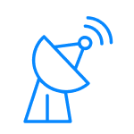
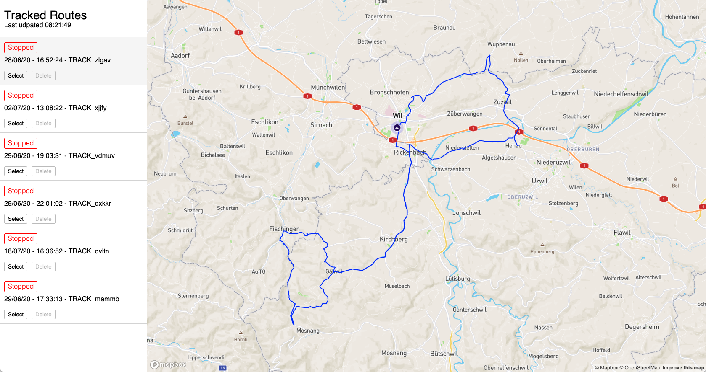

# Location Tracker

)

A realtime tracking dashboard to visualize geo locations using firebase and GeoJSON.

View it here: [Location Tracking Dashboard](https://location-tracking-dashboard.vercel.app/)

## How it works

1. A companion app (e.g. [Location Tracker](https://github.com/MrF3lix/location-tracker)) records GPS coordinates and sends them to a Firebase Realtime Database.
2. The Dashboard then shows the recorded coordinates in real time.

## Why?

This project was created to showcase location tracking in a React Native app while the app is in the background or suspended.
